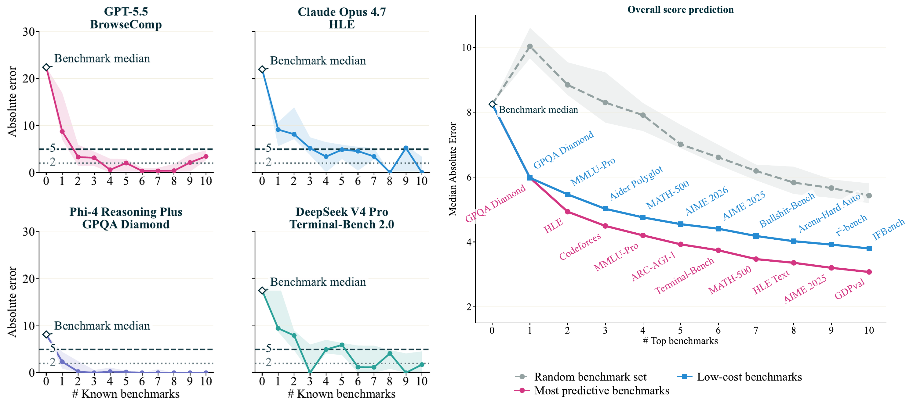

<h1 align="center"> <p>You Don't Need to Run Every Eval</p></h1>
<h4 align="center">
    <p>
      <a href="https://yzeng58.github.io/" target="_blank">Yuchen Zeng</a>, <a href="https://papail.io/" target="_blank">Dimitris Papailiopoulos</a>
    </p>
    <p>
      Microsoft Research, AI Frontiers
    </p>
</h4>
<p align="center">
    <!-- TODO: replace with real release tag once published -->
    <a href="https://github.com/microsoft/benchpress/releases">
        
    </a>
    <!-- TODO: replace with arXiv link once posted -->
    <a href="#">
        
    </a>
    <a href="https://github.com/microsoft/benchpress/blob/main/LICENSE">
        
    </a>
</p>

<p align="center">
  <a href="https://yzeng58.github.io/benchpress-site/">Project page</a> ·
  <a href="https://github.com/microsoft/benchpress">Code</a> ·
  <a href="https://huggingface.co/datasets/yzeng58/benchpress-score-matrix">Dataset</a> ·
  <a href="#">Paper coming soon</a>
</p>

**Abstract**: A modern model release reports scores on 40+ benchmarks; behind the release, evaluations were run orders of magnitude more often across checkpoints, hyperparameter sweeps, and design choices. We ask whether scores accumulated across public releases can *anticipate* a model's performance on benchmarks it has not yet been run on, and decide which evaluations are most worth running next.

We compile a public score matrix of 84 frontier models on 133 benchmarks (2,604 observed cells, 23.3% filled) and find its geometry is approximately rank-2: across complete submatrices, two factors explain more than 90% of the variance. We exploit this structure with **BenchPress**: logit-space bias-decomposed rank-2 matrix completion, which completes hidden scores within a **4.6** score-point median absolute error. A reliability analysis identifies when these predictions can be trusted &mdash; errors fall when the target model has richer observed evidence and behaviorally similar peers &mdash; calibrating 90% prediction intervals.

Finally, we stress-test deployment: **five probe benchmarks predict the rest of the profile** to a median absolute error of **3.93** score points (**4.55** on a low-cost allowlist) while preserving **92.1%** of pairwise model rankings, and reach **5.0** on brand-new releases.

<p align="center">
  
</p>

# News  🚀

<!-- TODO: replace with actual release date + arXiv announcement -->
* [TBD] BenchPress paper and code released.

# Contents

- [Step 1: Set Up Environment](#step-1-set-up-environment)
- [Step 2: The Data](#step-2-the-data)
- [Step 3: Predict Scores](#step-3-predict-scores)
  - [Predict for an Existing Model](#predict-for-an-existing-model)
  - [Add Your Own Model](#add-your-own-model)
- [Step 4: Reproduce Paper Experiments](#step-4-reproduce-paper-experiments)
  - [Repository Structure](#repository-structure)
  - [Artifact Policy](#artifact-policy)
  - [Run a Single Experiment](#run-a-single-experiment)
- [Step 5: Cite Us](#step-5-cite-us)

# Step 1: Set Up Environment

To set up the environment for using BenchPress, please follow the steps below.

1. Clone this repository and rename it as `benchpress`

   ```bash
    git clone https://github.com/microsoft/benchpress
    cd benchpress
   ```

2. Install Packages

   <details><summary> Linux / Mac </summary>

   ```bash
   conda create -n benchpress python=3.10
   conda activate benchpress
   pip install -e .          # editable install — makes `from benchpress.*` work everywhere
   python -m benchpress.download_data
   ```

   </details>

   <details><summary> Windows </summary>
   TBA
   </details>

# Step 2: The Data

BenchPress uses a citation-backed evaluation matrix:

- **189 frontier LLMs** from 28 providers (OpenAI, Anthropic, Google, Meta, DeepSeek, Alibaba, Mistral, xAI, Moonshot AI, Zhipu AI, Microsoft, ByteDance, Amazon, MiniMax, NVIDIA, Cohere, Allen AI, IBM, Liquid AI, LG AI Research, Hugging Face, OpenBMB, TII, Sarvam AI, Shanghai AI Lab, Open Thoughts, Meituan, Mistral AI) — **before filtering**
- **316 benchmarks** across 59 categories — **before filtering**
- **4,905 observed scores**, each citation-backed
- Paper-canonical filter (keep models with $\geq 15$ observed scores and benchmarks with $\geq 8$ observed models), with duplicate/setting-variant exclusions: **84 models × 133 benchmarks**, 2,604 observed (23.3% fill rate)
- **Smart clip**: only percentage-scale benchmarks are clipped to [0, 100]; Elo/rating benchmarks (Codeforces, Chatbot Arena, GDP-Val) are left unclipped

The paper-canonical dataset is published at:

- **Hugging Face**: <https://huggingface.co/datasets/yzeng58/benchpress-score-matrix>
- **Local cache after download**: `benchpress/data/llm_benchmark_data.json`

After running `python -m benchpress.download_data`, local matrix files live in `benchpress/data/`:

```
benchpress/data/
├── llm_benchmark_data.json        # Machine-readable scores
├── benchmark_cost_evidence.json   # Raw cost-evidence extracts, when available
└── *.md                           # Data schema and provenance notes, when available
```

The downloader is artifact-first. If the full JSON export is available on Hugging Face, it downloads that exact artifact. If only the public table mirror is available, it reconstructs the paper score matrix from the mirror and prints the limitation explicitly; that fallback preserves the paper matrix but may not include every rich provenance field such as cost evidence and candidate-level score traces.

`llm_benchmark_data.json` is the canonical source for code. It contains:

- `models[]`: model metadata, including provider and release/canonical-setting fields when available
- `benchmarks[]`: benchmark metadata, including category, scale, canonical-setting fields, and cost evidence when available
- `scores[]`: observed cells as `{model_id, benchmark_id, score, reference_url}` records

Use it directly from the package:

```python
from benchpress.evaluation_harness import M_FULL, MODEL_IDX, BENCH_IDX

score = M_FULL[MODEL_IDX["gpt-5.2"], BENCH_IDX["gpqa_diamond"]]
```

or load the JSON yourself:

```python
import json
from pathlib import Path

data = json.loads(Path("benchpress/data/llm_benchmark_data.json").read_text())
scores = data["scores"]
```

Or load the public Hugging Face mirror:

```python
from datasets import load_dataset

ds = load_dataset("yzeng58/benchpress-score-matrix", "scores_paper")
```

# Step 3: Predict Scores

## Predict for an Existing Model

```bash
# Predict all missing scores for a model
python predict.py --model gpt-5.2

# Predict a single score
python predict.py --model gpt-5.2 --benchmark gpqa_diamond

# List available models / benchmarks
python predict.py --list-models
python predict.py --list-benchmarks
```

## Add Your Own Model

Provide a few known scores; BenchPress predicts the rest.

```bash
python predict.py --add-model my-model \
  --scores "simpleqa=50.0,gpqa_diamond=70.0,aime_2025=55.0"
```

<details><summary> What happens under the hood </summary>

BenchPress uses **Logit + Bias ALS**:

1. Transform percentage-scale scores with logit; leave non-percentage benchmarks in their native score space.
2. Z-score each benchmark column, then fit a bias-decomposed low-rank ALS model with per-model bias, per-benchmark bias, and rank-2 latent factors.

Predictions are inverted back to score space and **smart-clipped**: percentage-scale benchmarks are clamped to [0, 100]; Elo/rating benchmarks (Codeforces, Chatbot Arena, GDP-Val, Swelancer, Vending-Bench) are left unclipped.

</details>

| Method | MedAPE ↓ | MedAE ↓ | Within ±3 pts | Within ±5 pts | Coverage |
|--------|----------|---------|---------------|---------------|----------|
| **BenchPress (Logit Bias ALS)** | **7.8%** | **4.60** | **36.6%** | **52.8%** | **100%** |

Canonical fold-level BenchPress predictions are generated under `benchpress/evaluation/default_predictions/benchpress_default/` when needed.

All numbers use per-model 3-fold holdout (10 seeds × 3 folds = 30 folds): each seed partitions every model's observed benchmark scores into three disjoint test folds. Primary metric: MedAPE (median absolute percentage error). Matrix: 84 models × 133 benchmarks, 2,604 observed cells.

# Step 4: Reproduce Paper Experiments

## Repository Structure

```
benchpress/
├── benchpress/                           # Core library (editable install)
│   ├── data/                             #   Canonical score/cost data + schema
│   ├── evaluation/                       #   Folds + generated default prediction artifacts
│   ├── methods/                          #   Transforms, completers, predictors, confidence
│   ├── build_benchmark_matrix/           #   Raw sources → canonical matrix construction
│   ├── plot_helpers/                     #   Shared plotting + visual identity
│   ├── evaluation_harness.py             #   Matrix loader, holdout protocols, metrics
│   ├── io_utils.py                       #   Shared JSON / gzip JSON / atomic writes
│   └── shard_utils.py                    #   Shared shard execution/merge helpers
│
├── experiments/                          # All experiments, mirroring paper sections
│   ├── sec1_intro/hero_figure/           #   §1 — Hero figure
│   ├── sec3_low_rank/                    #   §3 — Low-rank structure (matrix viz, SVD)
│   ├── sec4_building_benchpress/         #   §4 — Building BenchPress (recipe ablations)
│   ├── sec5_findings/                    #   §5 — Findings (predictability, ranking, robustness)
│   └── appendix_*/                       #   Appendix experiments
├── predict.py                            # CLI prediction tool
└── pyproject.toml
```

Each experiment leaf folder follows a consistent structure:

```
experiments/sec4_building_benchpress/method_comparison/
├── run.py              # Run the experiment
├── plot.py             # Generate figures
├── manifest.json       # Generated method/transform grid
├── results.json        # Generated aggregate results
├── predictions/        # Generated bottleneck fold-level predictions
└── figures/            # Generated figures (PDF + PNG)
```

## Artifact Policy

Large generated artifacts are not checked into the release repository. This includes `results.json`, `manifest.json`, `predictions/*.npz`, confidence-score caches, generated figures, and generated tables. Experiment scripts follow an artifact-first policy: read an existing artifact if present, generate it from the documented upstream command if it is missing, and fail with the missing path and command if the upstream job cannot complete in the current environment.

This means plotting and table scripts can be run from a clean clone, but some first runs are intentionally expensive because they recreate fold-level prediction shards, confidence-calibration scores, API-model outputs, or other bottleneck artifacts. For example, `method_comparison/plot.py` will create missing `predictions/*.npz`, `manifest.json`, and `results.json` by running `method_comparison/run.py --merge`; confidence plots similarly create `confidence_scores.npz` and `results.json` via `confidence_calibration/run.py --ensure`. Once generated, these artifacts stay local and are reused by later scripts.

## Run a Single Experiment

```bash
conda activate benchpress

python experiments/sec4_building_benchpress/method_comparison/run.py --merge
python experiments/sec4_building_benchpress/method_comparison/plot.py
```

# Step 5: Cite Us

<!-- TODO: replace with arXiv eprint + journal entry once posted -->
```tex
@article{zeng2026benchpress,
  title={You Don't Need to Run Every Eval},
  author={Zeng, Yuchen and Papailiopoulos, Dimitris},
  journal={arXiv preprint arXiv:XXXX.XXXXX},
  year={2026}
}
```
