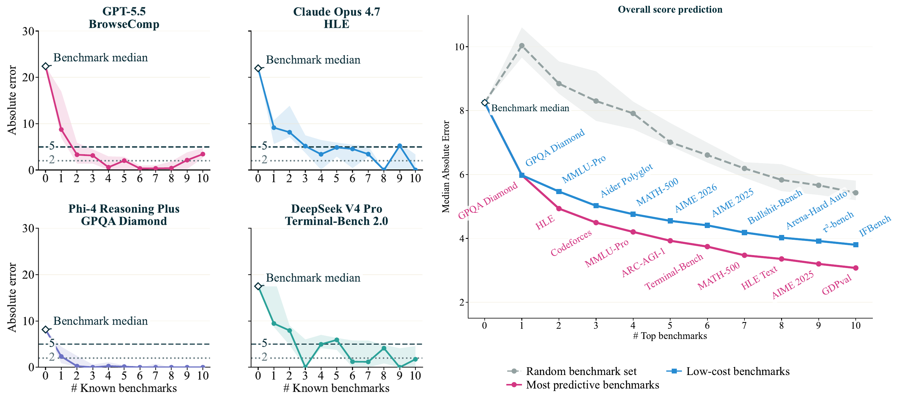
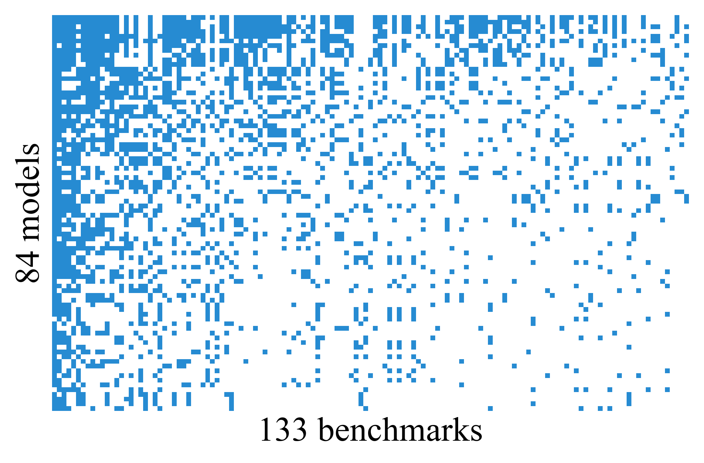

<h1 align="center"> <p>You Don't Need to Run Every Eval</p></h1>
<h4 align="center">
    <p>
      <a href="https://yzeng58.github.io/" target="_blank">Yuchen Zeng</a>, <a href="https://papail.io/" target="_blank">Dimitris Papailiopoulos</a>
    </p>
    <p>
      Microsoft Research, AI Frontiers
    </p>
</h4>
<p align="center">
    <!-- TODO: replace with real release tag once published -->
    <a href="https://github.com/microsoft/benchpress/releases">
        
    </a>
    <a href="https://arxiv.org/pdf/2606.24020">
        
    </a>
    <a href="https://github.com/microsoft/benchpress/blob/main/LICENSE">
        
    </a>
</p>

<p align="center">
  <a href="https://microsoft.github.io/benchpress/">Project page</a> ·
  <a href="https://github.com/microsoft/benchpress">Code</a> ·
  <a href="https://huggingface.co/datasets/microsoft/benchpress-score-matrix">Dataset</a> ·
  <a href="https://arxiv.org/pdf/2606.24020">Paper</a>
</p>

**Abstract**: A modern model release reports scores on 40+ benchmarks; behind the release, evaluations were run orders of magnitude more often across checkpoints, hyperparameter sweeps, and design choices. We ask whether scores accumulated across public releases can *anticipate* a model's performance on benchmarks it has not yet been run on, and decide which evaluations are most worth running next.

We compile a public score matrix of 84 frontier models on 133 benchmarks (2,604 observed cells, 23.3% filled) and find its geometry is approximately rank-2: across complete submatrices, two factors explain more than 90% of the variance. We exploit this structure with **BenchPress**: logit-space bias-decomposed rank-2 matrix completion, which completes hidden scores within a **4.6** score-point median absolute error. A reliability analysis identifies when these predictions can be trusted &mdash; errors fall when the target model has richer observed evidence and behaviorally similar peers &mdash; calibrating 90% prediction intervals.

Finally, we stress-test deployment: **five probe benchmarks predict the rest of the profile** to a median absolute error of **3.93** score points (**4.55** on a low-cost allowlist) while preserving **92.1%** of pairwise model rankings, and reach **5.0** on brand-new releases.

<p align="center">
  
</p>

# News  🚀

* [2026-06-23] [BenchPress paper](https://arxiv.org/pdf/2606.24020) and code released.

# Contents

- [Step 1: Set Up Environment](#step-1-set-up-environment)
- [Step 2: Get a Score Matrix](#step-2-get-a-score-matrix)
  - [Option A: Use the BenchPress Matrix](#option-a-use-the-benchpress-matrix)
  - [Option B: Import a Supported External Score Matrix](#option-b-import-a-supported-external-score-matrix)
  - [Option C: Bring Your Own CSV Score Matrix](#option-c-bring-your-own-csv-score-matrix)
- [Step 3: Predict Scores](#step-3-predict-scores)
  - [Predict for an Existing Model](#predict-for-an-existing-model)
  - [Add Your Own Model](#add-your-own-model)
- [Step 4: Reproduce Paper Experiments](#step-4-reproduce-paper-experiments)
  - [Repository Structure](#repository-structure)
  - [Artifact Policy](#artifact-policy)
  - [Run a Single Experiment](#run-a-single-experiment)
- [Step 5: Maintain the Living Matrix](#step-5-maintain-the-living-matrix)
- [Step 6: Cite Us](#step-6-cite-us)

# Step 1: Set Up Environment

To set up the environment for using BenchPress, please follow the steps below.

1. Clone this repository and rename it as `benchpress`

   ```bash
    git clone https://github.com/microsoft/benchpress
    cd benchpress
   ```

2. Install Packages

   <details><summary> Linux / Mac </summary>

   ```bash
   conda create -n benchpress python=3.10
   conda activate benchpress
   pip install -e .          # editable install — makes `from benchpress.*` work everywhere
   python -m benchpress.download_data
   ```

   </details>

   <details><summary> Windows </summary>
   TBA
   </details>

# Step 2: Get a Score Matrix

BenchPress predicts on *a* score matrix: a table of `models x benchmarks` (missing cells left empty) with a metric spec for each benchmark column. You can use our curated matrix (Option A), import a supported external score source into the BenchPress CSV matrix format (Option B), or write the CSV matrix yourself (Option C). All three feed the same predictor in Step 3.

## Option A: Use the BenchPress Matrix

BenchPress ships a citation-backed evaluation matrix:

- **189 frontier LLMs** from 28 providers (OpenAI, Anthropic, Google, Meta, DeepSeek, Alibaba, Mistral, xAI, Moonshot AI, Zhipu AI, Microsoft, ByteDance, Amazon, MiniMax, NVIDIA, Cohere, Allen AI, IBM, Liquid AI, LG AI Research, Hugging Face, OpenBMB, TII, Sarvam AI, Shanghai AI Lab, Open Thoughts, Meituan, Mistral AI) — **raw audit pool**
- **316 benchmarks** across 59 categories — **raw audit pool**
- **4,903 numeric scores** in the raw audit pool, each carrying a source reference and an `audit_status` (see `benchpress/data/SCHEMA.md`)
- Audit filter (keep `audit_status` in `verified` / `verified_third_party`; this is the loader default): **188 models × 316 benchmarks**, 4,493 observed
- Paper-canonical filter (keep models with $\geq 15$ observed scores and benchmarks with $\geq 8$ observed models), with duplicate/setting-variant exclusions: **84 models × 133 benchmarks**, 2,604 observed (23.3% fill rate)
- **Smart clip**: only percentage-scale benchmarks are clipped to [0, 100]; Elo/rating benchmarks (Codeforces, Chatbot Arena, GDP-Val) are left unclipped

<p align="center">
  
  <br>
  <em>Observed (blue) vs. missing (white) cells in the paper-canonical 84 × 133 score matrix.</em>
</p>

The public dataset is published at:

- **Hugging Face**: <https://huggingface.co/datasets/microsoft/benchpress-score-matrix>
- **Local cache after download**: `benchpress/data/llm_benchmark_data.json`

The BenchPress code is released under MIT. The score-matrix dataset is released
under the Community Data License Agreement - Permissive - Version 2.0
(`CDLA-Permissive-2.0`); see `benchpress/data/LICENSE-CDLA-2.0.md`.

BenchPress is a living dataset: new model releases, benchmark updates, and corrected citations can be added as the evaluation landscape changes. We welcome pull requests that add citation-backed scores, new models, new benchmarks, or provenance fixes.

After running `python -m benchpress.download_data`, the package creates a local
JSON cache under `benchpress/data/`:

```
benchpress/data/
├── llm_benchmark_data.json         # Machine-readable scores
├── benchmark_cost_evidence.json    # Raw cost-evidence extracts, when available
├── *.md                            # Data schema and provenance notes
└── _hf_cache/                      # Downloaded CSV mirror, when JSON is rebuilt from tables
```

The Hugging Face release is the public table export. It includes `scores_all`
(the pre-filter public score table), `scores_paper` (the paper-canonical
84-model x 133-benchmark matrix), plus model and benchmark metadata. The
downloader rebuilds `llm_benchmark_data.json` from this public mirror when a
full JSON artifact is not present. That rebuilt JSON is sufficient for package
use and paper-matrix reproduction, but it is not the complete internal audit
artifact: rich fields such as `candidates[]` and raw cost-evidence traces may be
absent.

`llm_benchmark_data.json` is the canonical source for code. It contains:

- `models[]`: model metadata, including provider and release/canonical-setting fields when available
- `benchmarks[]`: benchmark metadata, including category, scale, canonical-setting fields, and cost evidence when available
- `scores[]`: observed cells as `{model_id, benchmark_id, score, reference_url}` records

Use it directly from the package:

```python
from benchpress.evaluation_harness import M_FULL, MODEL_IDX, BENCH_IDX

score = M_FULL[MODEL_IDX["gpt-5.2"], BENCH_IDX["gpqa_diamond"]]
```

or load the JSON yourself:

```python
import json
from pathlib import Path

data = json.loads(Path("benchpress/data/llm_benchmark_data.json").read_text())
scores = data["scores"]
```

Or load the public Hugging Face mirror:

```python
from datasets import load_dataset

ds = load_dataset("microsoft/benchpress-score-matrix", "scores_paper")
```

## Option B: Import a Supported External Score Matrix

Use this path when scores already exist in a supported external source. Each importer downloads that source's public data and writes a normal BenchPress matrix folder:

```
<source>_matrix/
├── scores.csv             # model x benchmark table
├── scores.meta.json       # metric type/range metadata
└── raw/                   # downloaded source files
```

After that, prediction is always the same: pass the generated `scores.csv` to `predict.py`.

Supported imports:

- **EEE** ([Every Eval Ever](https://github.com/evaleval/every_eval_ever)): a shared schema and datastore for AI evaluation results.

  ```bash
  python -m benchpress.data.eee.curate_matrix --output ~/Downloads/eee_matrix
  python predict.py --matrix ~/Downloads/eee_matrix/scores.csv --list-models
  python predict.py --matrix ~/Downloads/eee_matrix/scores.csv --list-benchmarks
  python predict.py --matrix ~/Downloads/eee_matrix/scores.csv --model <model-id>
  ```

- **HELM** ([Holistic Evaluation of Language Models](https://crfm.stanford.edu/helm/)): Stanford CRFM's benchmark suite and evaluation result format. By default, BenchPress imports HELM's top-level overview score groups only, so scenario drilldowns and ablation tables do not get mixed into the matrix. Add `--include-drilldowns` only if you explicitly want those detailed tables too.

  ```bash
  python -m benchpress.data.helm.curate_matrix --output ~/Downloads/helm_matrix
  python predict.py --matrix ~/Downloads/helm_matrix/scores.csv --model <model-id>
  ```

If a source requires authentication, log in with that source's standard CLI before running the downloader. For Hugging Face-hosted sources, run `huggingface-cli login` first.

## Option C: Bring Your Own CSV Score Matrix

Use this path when you want to write the matrix yourself. In this mode, `--matrix` is always the path to `scores.csv`.

Create a folder anywhere (named whatever you like) with one required file and one optional file:

```
my_matrix/                 # a folder you create anywhere
├── scores.csv             # required: your score table
└── scores.meta.json       # optional: scale info, must sit next to scores.csv
```

- `scores.csv` is the score table. Rows are your models, columns are benchmarks, and each cell is a score. An empty cell means the model was never run on that benchmark, and BenchPress predicts it. The first header cell must be the word `model`; the other headers and the model names are names you choose, and none may repeat.

  ```csv
  model,gpqa_diamond,aime_2025,chatbot_arena_elo
  my-model-a,72.0,55.0,1310
  my-model-b,68.5,,1288
  my-model-c,,61.2,
  ```

- `scores.meta.json` is only needed when a column is not scored 0 to 100 (for example, Chatbot Arena Elo is around 1300). List each such column so BenchPress does not treat it as a percentage. Columns you do not list are assumed to be 0 to 100.

  ```json
  { "chatbot_arena_elo": {"type": "elo", "range": [800, 1600]} }
  ```

Then predict the empty cells. Run this from the `benchpress` repo (where `predict.py` lives); give `--matrix` the path to your CSV, and `--model` one of your model names:

```bash
python predict.py --matrix /path/to/my_matrix/scores.csv --model my-model-a
```

By default, custom-matrix predictions print a terminal-readable report:

```text
Prediction results for my-model-a
Matrix: /path/to/my_matrix/scores.csv
Showing missing cells only. Use --all to include observed scores.

benchmark  score  status     support       metric
---------  -----  ---------  ------------  ------------
aime_2025  54.2   predicted  row 2, col 2  pct [0, 100]
```

Use `--format csv` or `--format json` when you want machine-readable output.

Add `--confidence` when you want BenchPress to check how trustworthy the predictions look on your own matrix:

```bash
python predict.py --matrix /path/to/my_matrix/scores.csv --model my-model-a --confidence
```

For a custom matrix, `--confidence` does not use the calibrated confidence model trained on the built-in BenchPress dataset. Instead, it reruns BenchPress in leave-one-observed-cell-out mode on your matrix: each known score is hidden once, predicted from the remaining scores, and compared with the true value. The report then shows test MedAE, test MedAPE, and an empirical 90% interval for each predicted missing score:

```text
Holdout validation on observed cells:
  evaluated cells: 7
  test MedAE: 11.06
  test MedAPE: 7.89%

benchmark  score  interval_90   status     support       metric
---------  -----  ------------  ---------  ------------  ------------
aime_2025  54.2   [43.3, 65.1]  predicted  row 2, col 2  pct [0, 100]
```

`support` is the amount of evidence available for that prediction: `row 2` means that model has 2 known scores, and `col 2` means that benchmark has scores from 2 models. On very small matrices, the interval is a rough empirical warning signal, not a formal guarantee.

The holdout run is cached next to your matrix file. For `/path/to/my_matrix/scores.csv`, BenchPress writes `/path/to/my_matrix/__benchpress_cache__/holdout_<hash>.json`. The hash includes the loaded scores, model IDs, benchmark IDs, metric metadata, and cache version, so editing `scores.csv` or `scores.meta.json` creates a new cache entry automatically.

Use `--format csv` or `--format json` with `--confidence` when you want the same fields in machine-readable output.

The path can be absolute (as above, so your folder can be anywhere) or relative to the `benchpress` repo. The same works from Python:

```python
from benchpress.data.score_matrix import ScoreMatrix
from benchpress.methods.predictors import predict_logit_bias_als_scores

sm = ScoreMatrix.from_csv("/path/to/my_matrix/scores.csv")
M_hat = predict_logit_bias_als_scores(
    sm.values,
    metric=sm.metric,
    benchmark_ids=sm.benchmark_ids,
)
```

# Step 3: Predict Scores

## Predict for an Existing Model

```bash
# Predict all missing scores for a model
python predict.py --model gpt-5.2

# Predict a single score
python predict.py --model gpt-5.2 --benchmark gpqa_diamond

# List available models / benchmarks
python predict.py --list-models
python predict.py --list-benchmarks
```

## Add Your Own Model

Provide a few known scores; BenchPress predicts the rest.

```bash
python predict.py --add-model my-model \
  --scores "simpleqa=50.0,gpqa_diamond=70.0,aime_2025=55.0"
```

<details><summary> What happens under the hood </summary>

BenchPress uses **Logit + Bias ALS**:

1. Transform percentage-scale scores with logit; leave non-percentage benchmarks in their native score space.
2. Z-score each benchmark column, then fit a bias-decomposed low-rank ALS model with per-model bias, per-benchmark bias, and rank-2 latent factors.

Predictions are inverted back to score space and **smart-clipped**: percentage-scale benchmarks are clamped to [0, 100]; Elo/rating benchmarks (Codeforces, Chatbot Arena, GDP-Val, Swelancer, Vending-Bench) are left unclipped.

</details>

| Method | MedAPE ↓ | MedAE ↓ | Within ±3 pts | Within ±5 pts | Coverage |
|--------|----------|---------|---------------|---------------|----------|
| **BenchPress (Logit Bias ALS)** | **7.8%** | **4.60** | **36.6%** | **52.8%** | **100%** |

Canonical fold-level BenchPress predictions are generated under `benchpress/evaluation/default_predictions/benchpress_default/` when needed.

All numbers use per-model 3-fold holdout (10 seeds × 3 folds = 30 folds): each seed partitions every model's observed benchmark scores into three disjoint test folds. Primary metric: MedAPE (median absolute percentage error). Matrix: 84 models × 133 benchmarks, 2,604 observed cells.

# Step 4: Reproduce Paper Experiments

## Repository Structure

```
benchpress/
├── benchpress/                           # Core library (editable install)
│   ├── data/                             #   Canonical score/cost data + schema
│   ├── evaluation/                       #   Folds + generated default prediction artifacts
│   ├── methods/                          #   Transforms, completers, predictors, confidence
│   ├── build_benchmark_matrix/           #   Raw sources → canonical matrix construction
│   ├── plot_helpers/                     #   Shared plotting + visual identity
│   ├── evaluation_harness.py             #   Matrix loader, holdout protocols, metrics
│   ├── io_utils.py                       #   Shared JSON / gzip JSON / atomic writes
│   └── shard_utils.py                    #   Shared shard execution/merge helpers
│
├── experiments/                          # All experiments, mirroring paper sections
│   ├── sec1_intro/hero_figure/           #   §1 — Hero figure
│   ├── sec3_low_rank/                    #   §3 — Low-rank structure (matrix viz, SVD)
│   ├── sec4_building_benchpress/         #   §4 — Building BenchPress (recipe ablations)
│   ├── sec5_findings/                    #   §5 — Findings (predictability, ranking, robustness)
│   ├── sec6_trust/                       #   §6 — Trust (confidence calibration, hypotheses)
│   └── appendix_*/                       #   Appendix experiments
├── predict.py                            # CLI prediction tool
└── pyproject.toml
```

Each experiment leaf folder follows a consistent structure:

```
experiments/sec4_building_benchpress/method_comparison/
├── run.py              # Run the experiment
├── plot.py             # Generate figures
├── manifest.json       # Generated method/transform grid
├── results.json        # Generated aggregate results
├── predictions/        # Generated bottleneck fold-level predictions
└── figures/            # Generated figures (PDF + PNG)
```

## Artifact Policy

Large generated artifacts are not checked into the release repository. This includes `results.json`, `manifest.json`, `predictions/*.npz`, confidence-score caches, generated figures, and generated tables. Experiment scripts follow an artifact-first policy: read an existing artifact if present, generate it from the documented upstream command if it is missing, and fail with the missing path and command if the upstream job cannot complete in the current environment.

This means plotting and table scripts can be run from a clean clone, but some first runs are intentionally expensive because they recreate fold-level prediction shards, confidence-calibration scores, API-model outputs, or other bottleneck artifacts. For example, `method_comparison/plot.py` will create missing `predictions/*.npz`, `manifest.json`, and `results.json` by running `method_comparison/run.py --merge`; confidence plots similarly create `confidence_scores.npz` and `results.json` via `confidence_calibration/run.py --ensure`. Once generated, these artifacts stay local and are reused by later scripts.

## Run a Single Experiment

```bash
conda activate benchpress

python experiments/sec4_building_benchpress/method_comparison/run.py --merge
python experiments/sec4_building_benchpress/method_comparison/plot.py
```

# Step 5: Maintain the Living Matrix

BenchPress is maintained as a living score matrix. After adding citation-backed
models, benchmarks, or scores to `benchpress/data/llm_benchmark_data.json`, use
the maintenance wrappers to inspect and refresh downstream artifacts:

```bash
python maintenance/check_updates.py
maintenance/run_set.sh   # dry-run preview by default
```

To execute the matrix refresh and selected downstream steps, set the relevant
flags, for example:

```bash
DRY_RUN=0 RUN_MATRIX=1 RUN_GREEDY=1 RUN_PLOTS=1 RUN_WEBSITE=1 maintenance/run_set.sh
```

See `maintenance/README.md` for the full checklist.

# Step 6: Cite Us

```tex
@misc{zeng2026dontneedruneval,
  title={You Don't Need to Run Every Eval},
  author={Yuchen Zeng and Dimitris Papailiopoulos},
  year={2026},
  eprint={2606.24020},
  archivePrefix={arXiv},
  primaryClass={cs.LG},
  url={https://arxiv.org/abs/2606.24020}
}
```
